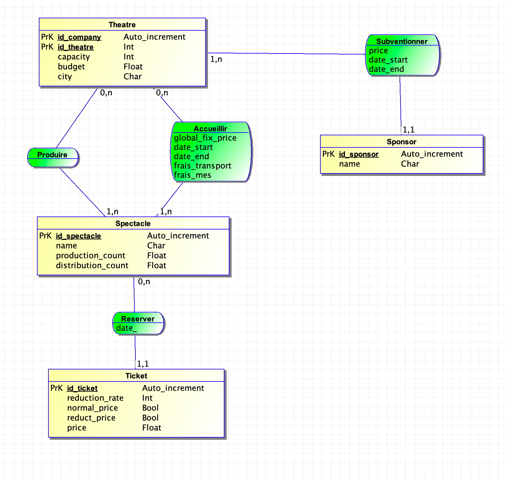

# Theatre Management Database System

## Overview

This project implements a **Theatre Management Database System** using MySQL. It is designed to manage the operations of theatres, including spectacles, ticket sales, sponsors, financial transactions, and performances. The system leverages stored procedures, triggers, and relational database principles to ensure efficient data handling and integrity.

---

## Features

1. **Database Tables**:
   - `Theatre`: Stores information about theatres (capacity, budget, city).
   - `Spectacle`: Represents shows or spectacles with details like production and distribution costs.
   - `Ticket`: Manages ticket sales and pricing, including reduced pricing logic.
   - `Sponsor`: Handles sponsor donations, categorized by donation type (e.g., Single, Monthly, Yearly).
   - `Produire`: Links theatres and the spectacles they produce.
   - `Transaction_History`: Logs all financial transactions between theatres.
   - `Accueillie`: Tracks hosted spectacles, including costs for travel, staging, and comedian fees.
   - `Calendar`: Manages dates for events and operations.
   - `day_show`: Tracks performances on specific dates.

2. **Stored Procedures**:
   - **`pay_sponsors`**: Updates theatre budgets based on sponsor donations and logs transactions.
   - **`pay_ticket`**: Calculates ticket revenue, updates theatre budgets, and logs ticket-related transactions.
   - **`main`**: Simulates daily operations for 20 days, including:
     - Hosting spectacles (`Accueillie` → `day_show`).
     - Handling travel, staging, and comedian fees.
     - Simulating ticket sales.
     - Managing sponsor payments.
     - Logging all financial transactions in `Transaction_History`.

3. **Triggers**:
   - **`before_update_Ticket`**: Automatically updates the number of tickets sold and adjusts reduced ticket prices based on theatre capacity and time-to-event logic.

4. **Constraints**:
   - Foreign keys enforce relationships between tables, ensuring referential integrity.

---

## Installation

1. **Prerequisites**:
   - MySQL server installed and running.
   - A MySQL client or IDE to execute the SQL script.

2. **Setup Steps**:
   - Execute the script in your MySQL environment to set up the database, tables, and constraints.
   - Populate the database with initial data provided in the script (`INSERT` statements for theatres).

---

## Usage

1. **Daily Operations**:
   - Use the `main` procedure to simulate daily activities and financial transactions.
   - Adjust the `nb_days` parameter to control the number of simulated days.

2. **Automated Financial Management**:
   - Sponsor donations and ticket revenues are automatically processed and recorded.
   - Expenses such as travel, staging, and comedian fees are deducted appropriately.

3. **Reports and Queries**:
   - Analyze `Transaction_History` for financial insights.
   - Query `Theatre`, `Spectacle`, and other tables for operational data.

---

## Key Business Logic

- **Ticket Price Adjustments**: 
  - Discounts are applied based on the number of tickets sold and time remaining until the event.

- **Sponsor Donations**:
  - Donations are processed according to the donation type (Single, Monthly, Yearly).

- **Performance Hosting Costs**:
  - Travel, staging, and comedian fees are managed based on hosting agreements.

- **Transaction Logging**:
  - Every financial operation is logged with details of payer, receiver, amount, and purpose.

---

## Future Improvements

- **Scalability**: Adapt the system for larger datasets or distributed environments.
- **Analytics**: Integrate reporting tools for advanced analytics.
- **Frontend**: Develop a user-friendly interface for managing operations.
- **Testing**: Automate testing for triggers, procedures, and business logic.

---

## Author

Ewen BERNARD & Sixtine Brisard
